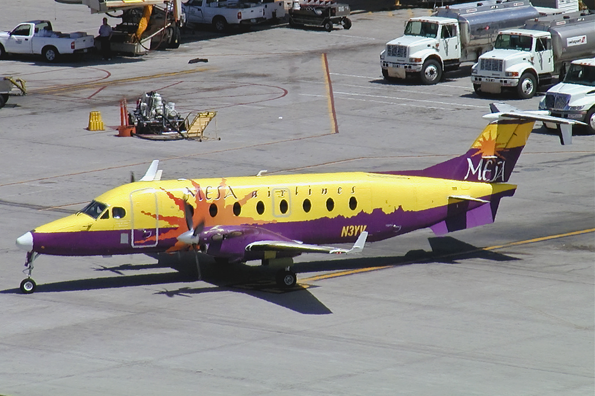

<style type="text/css">

body{ /* Normal  */
      font-size: 16px;
  }
}
h1.title {
  font-size: 30px;
  color: DarkBlue;
}
h1 { /* Header 1 */
  font-size: 28px;
  color: DarkBlue;
}
h2 { /* Header 2 */
    font-size: 16px;
  color: DarkBlue;
}

}
code.r{ /* Code block */
    font-size: 12px;
}
pre { /* Code block - determines code spacing between lines */
    font-size: 14px;
}
</style>

```{r library, message=FALSE, warning=FALSE, echo=FALSE}
library(data.table)
library(janitor)
library(tidyr)
library(ggplot2)
library(plotly)
library(stringr)
library(forcats)
library(tidyverse)
```

```{r loading_data , message=FALSE, warning=FALSE, echo=FALSE}

load_data = function(path){
  files = dir(path, pattern = "\\.csv", full.names = TRUE)
  tables = lapply(files, fread) ## search every csv file in the data folder
  do.call(rbind, tables)  ## combine 60 csv files by the name of columns using rbind() function
}

delay_data <- load_data("/srv/data/cumc/flightdelay/delay_data_5yrs") %>% ## When reproduce this project, please change the path to "./delay_data_5yrs"
  clean_names() %>% 
  mutate(month, month = factor(month, labels = month.name),  ## change month from number to month.name
         dep_time = as.character(dep_time),
         dep_time = substr(dep_time,1,2)) ## condense 1-59 minutes of each hour into one data point, eg., 1:00-1:59 -> 1:00
  
         
```

```{r airline, message=FALSE, warning= FALSE, echo=FALSE}
general_boxplot = delay_data %>% 
  filter(arr_del15 == 1) %>% # filter for choosing the flight that delayed 15 mins and above(our criterion for delay flights)
  select(unique_carrier, carrier_delay, weather_delay, nas_delay, security_delay, late_aircraft_delay) %>% 
  group_by(unique_carrier) %>%
   # get the summary data: the mean of delay minutes per delayed flights in different causes. The sum_mean_delay is used for reordering the factors of the following plot.
  summarize(mean_carrier_delay = mean(carrier_delay[carrier_delay != 0]), 
            mean_weather_delay = mean(weather_delay[weather_delay != 0]), 
            mean_nas_delay = mean(nas_delay[nas_delay != 0]), 
            mean_security_delay = mean(security_delay[security_delay != 0]), 
            mean_late_aircraft_delay = mean(late_aircraft_delay[late_aircraft_delay!= 0]), 
            sum_mean_delay = sum(mean_carrier_delay, 
                                 mean_weather_delay, 
                                 mean_nas_delay, 
                                 mean_security_delay, 
                                 mean_late_aircraft_delay)) %>% 
  # since some airline do no have the record for security delay, we made it to make the mean of delay minute in security delay is 0. Thus, the security delay minutes of these airlines will not shown the graph below.) 
  mutate(mean_security_delay = ifelse(is.nan(mean_security_delay), 0, mean_security_delay)) %>% 
  mutate(unique_carrier = reorder(unique_carrier, sum_mean_delay)) %>% 
  plot_ly(y = ~unique_carrier, 
          x = ~mean_carrier_delay, 
          type = 'bar', 
          orientation = 'h',
          name = 'carrier delay', 
          alpha = 0.8) %>% 
    add_trace(x = ~mean_weather_delay, name = 'weather delay') %>% 
    add_trace(x = ~mean_nas_delay, name = 'national aviation system delay') %>% 
    add_trace(x = ~mean_security_delay, name = 'security delay') %>% 
    add_trace(x = ~mean_late_aircraft_delay, name = 'late aircraft delay') %>% 
    layout(title = "Average Delay Minutes (per delayed flights) with Different Causes in Domestic Airlines",
           yaxis = list(title = "domestic airlines"),
           xaxis = list(title = "delay minute per delayed flight"), barmode = 'stack')
general_boxplot

```

\


Please note that the airline codes stand for:

  * `FL` = AirTran Airways Corporation
  * `F9` = Frontier Airlines Inc.
  * `DL` = Delta Air Lines Inc.
  * `YV` = Mesa Airlines 
  * `EV` = ExpressJet Airline Inc.
  * `OO` = SkyWest Airlines Inc.
  * `9E` = Endeavor Air Inc.
  * `UA` = United Air Lines Inc. 
  * `NK` = Spirit Air Lines
  * `VX` = Virgin America
  * `B6` = JetBlue Airways
  * `AS` = Alaska Airlines Inc.
  * `AA` = American Airline Inc.
  * `MQ` = Envoy Air
  * `US` = US Airways Inc.
  * `WN` = Southwest Airlines
  * `HA` = Hawaiian Airlines Inc.

***


\


# Total average delay minutes


* **Delta Air Lines** has the **longest** average delay minutes per flight among the delayed flights (average delay 200.4493 minutes per delayed flight in the sum of all causes). 
 
* Mesa Airlines, ExpressJet Airlines Inc., SkyWest Airlines Inc., and Endeavor Air Inc. also have a high average of delay minutes per flight among the delayed flights. 

* These high average delay time might be caused by some outliers that have extremely large delay minutes and the reason needs to be further investigated. For example, a piece of new showing that “A Delta Flight Was Delayed for 2 Hours Because a Pilot and Flight Attendant Had an Argument” might show a possible example of the outliers. (_www.Fortune.com_).


\       


# Average Security delay

* **Delta Air Lines** is affected **largely** on average security delay. 

* The average delay minutes per delayed flights of Delta Air Lines, caused by security delay, is almost twice of that of other airlines, such as American Airlines, and United Air Lines. 

* _AirTran Airways Corporation_ and _Frontier Airlines Inc._ do not have security delay on the graph, nor the dataset. It might be true that these two airlines barely experience delay due to security within the five years. However, it might not be ideal in the real world. One possible explanation could be that the data might be not recorded in the dataset.   


\


\


# Average National Aviation System delay

* **Virgin America** is affected **largely** on average National Aviation System delay. 
 
* The average delay minutes per delayed flights of Virgin America, caused by NAS delay, is almost twice of that of other airlines, such as Alaska Airlines, and SkyWest Airlines. 

\


# Average weather delay

* Weather delay affects the airlines almost evenly. 
 
* Most of the average delay minutes per delayed flights of different airlines, casued by weather delay, is around 40 minutes. 

* However, _Virgin America_ shows the lowest delay minutes (under 20 minutes) per delayed flight. 


\



\


# Average carrier delay

* **Mesa Airlines** is affected **largely** on average carrier delay . 
 
* The average delay minutes per delayed flights caused by carrier delay mainly fluctuates between 20 minutes to 45 minutes. 

\


# Average late aircraft delay

* Late aircraft delay affects the airlines almost evenly around 40 minutes
 
* However, _Hawaiian Airlines_ shows the lowest delay minutes (under 30 minutes) per delayed flight. 

